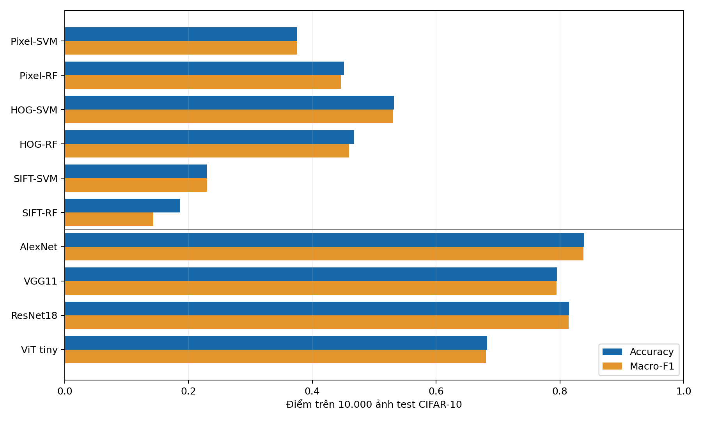

# CIFAR-10: AlexNet, VGG11, ResNet18 và ViT

Các mô hình được định nghĩa từ đầu bằng các lớp cơ bản của PyTorch, khởi tạo trọng số ngẫu nhiên và huấn luyện riêng. Không dùng pretrained/model zoo.

Các biến thể cho ảnh 32×32: AlexNet dùng năm convolution với GroupNorm và classifier hai lớp; VGG11-BN giữ tám convolution và năm pooling nhưng giảm số kênh; ResNet18 giữ tám residual block với stem 3×3 và base width 32; ViT tiny dùng patch 4×4, embedding 192, sáu block và ba attention head.

Loại chạy: **thí nghiệm theo cấu hình**. Seed: **42**. Epoch tối đa: **200**. Mẫu train/validation/test: **45000/5000/10000**. Thiết bị: **mps**.

Tập validation được tách phân tầng từ 50.000 ảnh train chính thức. Trọng số tốt nhất được chọn bằng accuracy validation; tập test chỉ được đánh giá sau đó. Chuẩn hóa dùng thống kê của tập train đã chọn. Không tăng cường dữ liệu.

| Mô hình | Số tham số | Epoch tốt nhất | Validation accuracy | Test accuracy | Test macro-F1 | Giây train |
|---|---:|---:|---:|---:|---:|---:|
| alexnet | 2,786,890 | 193 | 0.8518 | 0.8387 | 0.8381 | 12514.3 |
| vgg11 | 2,310,186 | 130 | 0.8120 | 0.7952 | 0.7944 | 7878.2 |
| resnet18 | 2,797,610 | 184 | 0.8262 | 0.8145 | 0.8141 | 23421.8 |
| vit_tiny | 2,693,578 | 180 | 0.6888 | 0.6821 | 0.6803 | 18642.1 |

Các kết quả này được đo trên đủ 10.000 ảnh test chính thức với đúng cấu hình huấn luyện ghi trên.

Mã chạy: `bash run_deep_models.sh` (đầy đủ) hoặc `bash run_deep_models.sh --quick` (kiểm tra luồng). JSON và checkpoint của lần chạy này nằm trong `outputs/deep_models_200_gn/`.

## So sánh với phương pháp truyền thống

SVM và bốn mạng được huấn luyện 200 epoch; Random Forest dùng 200 cây. Các mô hình dùng cùng cỡ tập dữ liệu và seed 42, nhưng chi phí tính toán và thuật toán tối ưu khác nhau.
